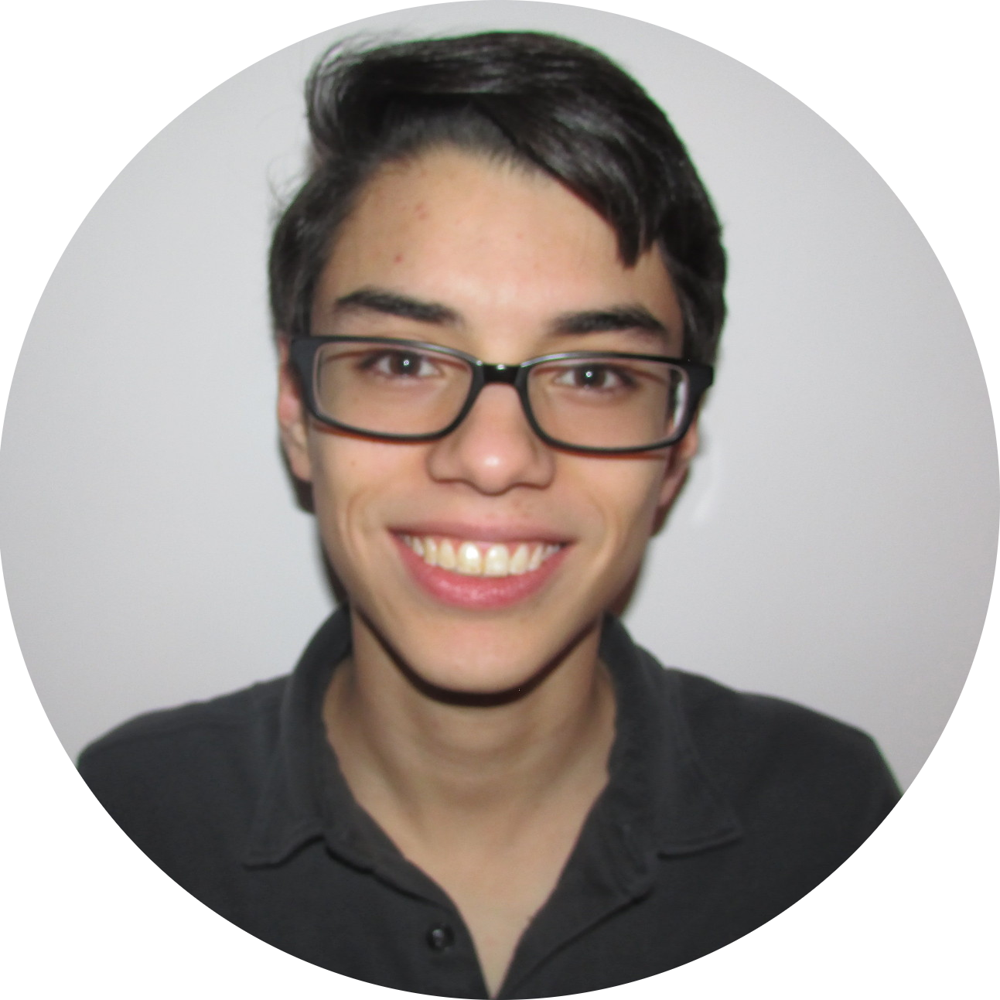

  

    
    <h1>About me</h1>
    

    
I currently live in Princeton and I am pursuing a graduate degree in Mathematics at Princeton University as a transfer student 
	from Northwestern University. At the moment and I am working on my dissertation. My thesis topic is on contact graph 3-manifolds with 
	applications to symplectic 4-manifolds.
	

 In the summer of 2021, I moved to Princeton University. I also gave a talk on disk bundle plumbings and lens spaces for the Graduate Student Seminar at Notre Dame.

 In the spring of 2021, I attended the <a href="https://gstgc2021.iu.edu/">Graduate Student Topology and Geometry Conference</a> at Indiana 
University. I also gave a talk on Milnor's Fibration Theorem for the Graduate Student Seminar at Notre Dame. I gave a talk on 
disk bundle plumbings and lens spaces for the Northwestern University Geometry Seminar. <a href="/assets/pdf/disk_bundle_plumbings_and_lens_spaces_2021.pdf">Here are some rough notes</a> for that talk.

 In the winter of 2020, I was the TA for two courses on abstract mathematics and proof methods. I also acted as coordinator for the Northwestern 
University Graduate Student Seminar (NUGSS) as well as the Northwestern Graduate Student Symplectic Geometry Seminar. I gave a talk on Milnor's 
Fibration Theorem for NUGSS.

 In the fall of 2020, I will be the TA for two courses on Linear Algebra. 

 In the summer of 2020, I attended the <a href="https://cmsa.fas.harvard.edu/2020-big-data-conference/">Harvard CSMA Big Data Conference</a>. I also attended the <a href="https://wp.math.berkeley.edu/pacificrim2020/titles-abstracts/">Eighth Pacific Rim Conference in Mathematics</a>. I participated in the <a href="https://math.mit.edu/~maggiehm/gtgaps_calendar">GTGAPS Seminar</a> and attended <a href="https://dzackgarza.com/GOATS/2020/June/">GOATS 2</a>. I mentored two students for the inaugural University of Chicago Virtual REU. You can read their papers <a href="http://math.uchicago.edu/~may/REU2020/">here</a> and <a href="http://math.uchicago.edu/~may/REU2020/">here</a>.

In the spring of 2020, I participated in and gave lectures for the <a href="https://www.math.ucla.edu/~archristian/seminars/s20/">UCLA Student Seminar on Flexibility in Contact Topology</a>. I also attended the <a href="https://researchseminars.org/seminar/WHSymplectic">Western Hemisphere Virtual Symplectic Seminar</a>.
	

 In the winter of 2019, Max Olander (Northwestern) and I read some <a href="http://library.msri.org/books/Book31/files/ball.pdf">notes</a> and 
<a href="https://web.stanford.edu/~boyd/cvxbook/">a book</a> on convex geometry. I organized a broad-audience seminar on Geometry called 
Geometry for All. I was also the TA for a course on Complex Analysis and a course on Linear Algebra.

 In the fall of 2019, I was a visiting graduate student at the Institute for Advanced Study. I also gave several lectures on Weinstein Manifolds for the Topics in Geometry course at Northwestern University. Finally, I completed my qualifying exam for PhD candidacy. The topic of my examination was <a href="https://projecteuclid.org/euclid.jdg/1214459407"> Donaldson's divisor theorem.</a>

 In the summer of 2019, I mentored three students for the University of Chicago's REU.

 In August of 2019, I attended <a href="https://sites.northwestern.edu/snap2019/">SNAP 2019</a>.

 In July of 2019, I visited CRM in Montreal for <a href="http://www.crm.umontreal.ca/sms/2019/index_e.php">Current Trends in Symplectic Topology</a>. I am in the group photo <a href="http://www.crm.umontreal.ca/sms/2019/img/_RPP9711.jpg">here</a>. I also visited the Fields Institute in Toronto for the <a href="http://www.fields.utoronto.ca/activities/19-20/mirrorsymmetry-gradsummerschool">Graduate Summer School on the Homological Algebra of Mirror Symmetry</a>. I am in the group photo <a href="http://www.fields.utoronto.ca/sites/default/files/resize/uploads/Graduate%20Summer%20School%20Group-750x450.jpg">here</a>

 In June of 2019, I attended and gave a talk at <a href="https://kylerec.wordpress.com/2019/07/01/notes-from-kylerec-2019/">Kylerec 2019</a>.

 In May of 2019, I attended <a href="https://sites.math.northwestern.edu/~tamarkin/Emphasis/Tsyganfest/">Tsyganfest</a> at Northwestern 
University.

 In April of 2019, I attended the joint UChicago/Northwestern Geometric Analysis Day.

 In March of 2019, I attended the <a href="https://faculty.math.illinois.edu/~hquan4/GSTGC2019/index.html">Graduate Student Topology and Geometry Conference</a> at the University of Illinois at Urbana-Champaign.

 In the spring of 2019, Alex Ortiz (MIT) and I read the first three chapters of Farkas and Kra's <a href="https://www.springer.com/gp/book/9780387977034">book on Riemann Surfaces</a>.

 In the winter of 2018, I attended the <a href="http://www.faculty.virginia.edu/tmark/VTC2018/index.html">Virginia Topology Conference</a> at 
the University of Virginia. I also helped organize a reading group on <a href="https://www.springer.com/gp/book/9783764357351">Gromov's Compactness theorem for Pseudoholomorphic Curves</a>.

 In the summer of 2018, I spent 3 weeks in Japan for the <a href="https://www.msri.org/summer_schools/856">MSRI h-Principle Summer School</a>. I
also mentored two students for the University of Chicago's REU. You can read their papers <a href="https://math.uchicago.edu/~may/REU2018/REUPapers/Tamar-Mattis.pdf">here</a> and <a href="https://math.uchicago.edu/~may/REU2017/">here</a>.

 In June of 2018, I took my preliminary exams to conclude my first year of graduate school.

 In April, I attended the <a href="https://www.math.uic.edu/gstgc2018/">Graduate Student Topology and Geometry Conference</a>.

 In March, I attended the joint UChicago/Nothwestern <a href="https://math.uchicago.edu/~geometric_analysis/gaday2018"> Geometric Analysis Day</a>.

 In January, I attended the <a href="https://www.math.uci.edu/~scgas/scgas-2018/2018.php">25th Southern California Geometric Analysis Seminar</a>.

 In the fall of 2017, I started my PhD at Northwestern University. I also attended the <a href="https://www.math.ksu.edu/events/conference/2017_Midwest_Geometry/2017_Midwest_Geometry.html">2017
midwest Geometry Conference</a>.

 In the summer of 2017, I mentored three students for the University of Chicago's REU. You can read their papers <a href="https://math.uchicago.edu/~may/REU2017/REUPapers/Wattal.pdf">here</a>, <a href="https://math.uchicago.edu/~may/REU2017/REUPapers/Kim.pdf"> here </a>, and
<a href="https://math.uchicago.edu/~may/REU2017/REUPapers/Green.pdf"> here </a>. In July and August, I attended the <a href="http://sites.math.northwestern.edu/SNAP2017/">2017 Summer Northwestern Analysis Program (SNAP)</a>. I'm in the group photos <a href="http://sites.math.northwestern.edu/SNAP2017/w1.jpg">here</a>, <a href="http://sites.math.northwestern.edu/SNAP2017/w2.jpg">here</a>, and <a href="http://sites.math.northwestern.edu/SNAP2017/w3.jpg">here</a>. In June, I attended the <a href="https://www3.nd.edu/~cmnd/programs/cmnd2017/">Thematic Program in Khaler Geometry 2017</a> at Notre Dame University.

 In June 2017, I graduated from the University of Chicago's MS-PSD program.

In the summer of 2016, I mentored three students for the University of Chicago's REU. You can read their papers <a href="https://math.uchicago.edu/~may/REU2016/REUPapers/Gaddy.pdf">here</a>, <a href="https://math.uchicago.edu/~may/REU2016/REUPapers/Morrison.pdf">here</a>, and <a href="https://math.uchicago.edu/~may/REU2016">here</a>. I also attended the University of Chicago <a href="https://math.uchicago.edu/~chicagotopology2/">Alebraic Topology Summer School</a> .

In 2016, I completed my Bachelor's Degree in Mathematics and graduated summa cum laude from the New Mexico Insitute of Mining and Technology.
   
 

In the summer of 2015, I attended the University of Chicago's REU. There I worked under <a href="https://www.math.uchicago.edu/~farb/">Professor Benson Farb</a>. The research I conducted was joint work with <a href="http://www.mit.edu/~phaine/">Peter Haine</a> about certain spaces of polynomials. You can read my perspective <a href="https://math.uchicago.edu/~may/REU2015/REUPapers/VanWhy.pdf">here</a>.

From 2012 to 2015, I worked as a student software engineer at <a href="https://www.passcal.nmt.edu/">IRIS/PASSCAL Instrument Center</a>. I wrote software that aided in the visualization and
    management of seismological sensor data. I worked on a small team with <a href="https://www.passcal.nmt.edu/users/azevedo">Steve Azevedo</a> and <a href="https://www.passcal.nmt.edu/users/dhess">Derick Hess</a>. I started work at PASSCAL with the intent of pursuing a career in Software Engineering. However, I left my position in order to focus on
    my Mathematics studies.

 In 2012, I started school at The New Mexico Institute of Mining and Technology as a dual Mathematics and Computer Science major. I studied Computer Science for 3 years before finally deciding to leave the field in favor of pure mathematics.

In 2012, I received my high school diploma from from the Albuquerque Institute for Math and Science.

When I am not studying math, I enjoy <a href="https://en.wikipedia.org/wiki/Go_(game)">Go</a>, music, tea, and meditation. Here are some of my favorite <a href="quotes">quotes</a>.
    

    
